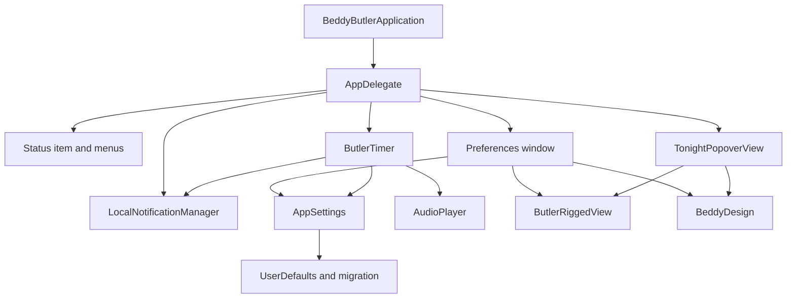

# Beddy Butler architecture

Beddy Butler is a native macOS menu bar app. The current source is intentionally small and dependency light. The first responsibility splits are complete locally, with notification delivery, the Tonight popover, and shared visual primitives now isolated from their former host files.

## Current runtime shape

## Component responsibilities

| Component | Current responsibility | Future split target |
| --- | --- | --- |
| `AppDelegate.swift` | Application lifecycle, status item, command menu, popover host, preference opening, external links, and system event observation | Consider a menu controller and link opener only if new behavior makes the boundary worthwhile |
| `LocalNotificationManager.swift` | Notification authorization, categories, local delivery, actions, and notification callbacks | Stable boundary |
| `TonightPopoverView.swift` | Compact status presentation and immediate Tonight actions | Stable boundary |
| `BeddyDesign.swift` | Shared palette, backdrop, card, capsule, and button primitives | Stable boundary |
| `PreferencesViewController.swift` | Preferences window host, preferences sections, bindings, and accessibility labels | Split schedule and delivery sections only when active feature work needs those boundaries |
| `UserDefaultKeys.swift` | Keys, settings model, schedule models, migration, clamping, persistence, derived state | Split into key definitions, persisted models, migration, and `AppSettings` facade |
| `ButlerTimer.swift` | Calendar safe scheduling, progressive state, mute and snooze timing, nudge delivery orchestration | Keep calculator pure, isolate delivery orchestration and runtime timer ownership |
| `ButlerRigView.swift` | SpriteKit rendering, choreography, reduced motion behavior, texture preparation | Keep as one rendering subsystem unless new character types are added |
| `AudioPlayer.swift` | Personality model, audio library, clip selection, playback | Keep simple, add transcript metadata only if needed |
| `LoginItems.swift` | `SMAppService` wrapper and state reporting | Stable |
| `Tools/*` | Reproducible validation, screenshots, release, App Store release | Keep deterministic and local by default |

## Refactor rules

1. Do not change product behavior while splitting files.
2. Keep scheduler tests passing after every scheduler or settings movement.
3. Move strings toward localization only after the current English UI is frozen.
4. Keep release scripts conservative: no network upload unless the invoked mode says upload and Nell has approved the candidate.
5. Keep historical repositories read only unless a specific donor comparison is required.

## Recommended refactor sequence

1. Completed locally: extract `LocalNotificationManager` from `AppDelegate.swift`.
2. Completed locally: extract `TonightPopoverView` from `AppDelegate.swift`.
3. Completed locally: extract shared design primitives into `BeddyDesign.swift`.
4. Next when justified: extract schedule sections from `PreferencesViewController.swift`.
5. Next when justified: extract settings models and migration from `UserDefaultKeys.swift`.
6. Add localization keys after the remaining model boundaries stabilize.

## Working if

A successful refactor reduces file size and responsibility boundaries while producing identical user visible behavior, identical persisted preferences, and a passing release validation run.
